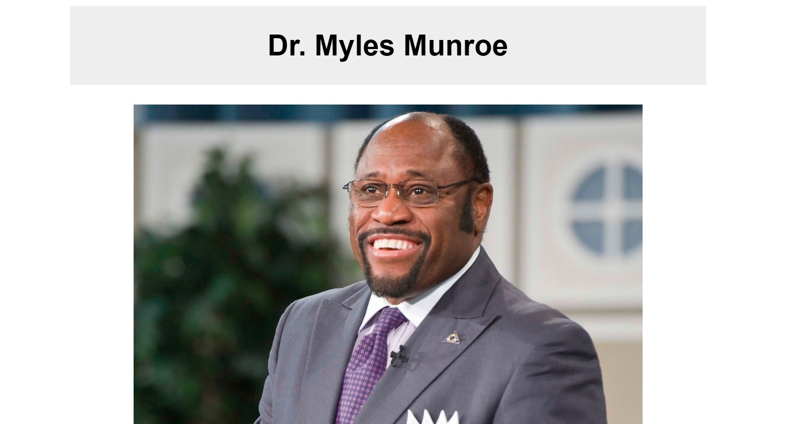

# Tibute Page

> This project is part of Free Code Camp. It is built with HTML5 and CSS.
> ![Screenshot]
> 
> 

## Built With

- Html
- CSS

## IDE and Tools

- Visual Studio Code

## Live Demo

[Live Demo Link](https://rawcdn.githack.com/biniamtekeste/tributepage/2fef95d49e79176804c8fc850ec134c5a73e6df3/index.html)

## Getting Started

**Click on the link above in order to see the Live Demo of the front end project.**

To get a local copy up and running follow these simple example steps.

### Prerequisites

- Web Browser
- Text Editor

### Setup

- Download repository files

## Authors

👤 **Author**

- Github: [@biniamtekeste](https://github.com/biniamtekeste)
- Twitter: [@binisuccess](https://twitter.com/binisuccess)
- Linkedin: [linkedin]()

## Show your support

Give a ⭐️ if you like this project!

## Acknowledgments

- [Free Code Camp](https://www.freecodecamp.org/)
- [Ericoders]

## 📝 License

This project is [MIT](lic.url) licensed.
